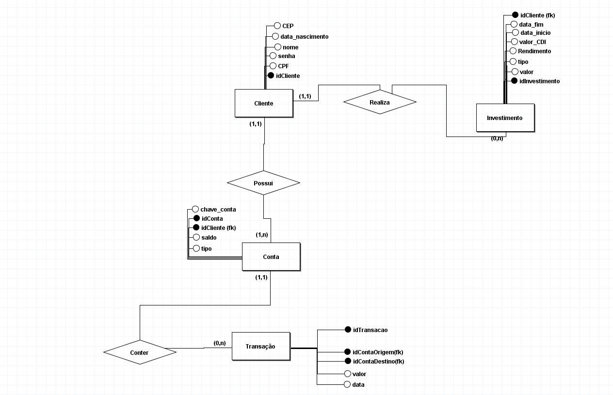

# Sistema Bancário em Python e SQL

Projeto de análise de transações bancárias utilizando Python, Pandas e MySQL.


## Descrição
O sistema é constituido por um banco de dados relacional, onde o cliente tem seu cadastro, contas, investimento e transações.

O objetivo principal é realizar a análise dos dados utilizando Selects e o framework Pandas do Python para arquivos CSV e gerar relatórios

Tecnologias principais:
- Integração SQL + Python

## Funcionalidades
- Cadastro de clientes
- Registro de transações
- Consultas SQL
- Análise de dados com Pandas
- Relatórios financeiros
- Tratamento de dados

## Tecnologias Utilizadas
- Python
- Pandas
- MySQL
- SQL
- Git
- GitHub
- matplotlib
- BrModelo

## Estrutura do Projeto

📂 Sistema-Bancario

- 📂 Python: analise_dados.py

- 📂 SQL: consultas.sql,  procedures.sql

- 📂 Dados_CSV: transacoes.csv

- 📂 DER: modelo_relacional.png

- README.md

## Banco de Dados
Para o banco de dados foi utilizado o Modelo conceitual



O banco foi constituido pelas seguintes entidades:
- Cliente
- Conta
- Investimento
- Transação

As entidades estão relacionadas com suas respectivas cardialidades.


## Análise de Dados
Foram feitas as seguintes análises
- média de gastos
- clientes com maior movimentação
- volume mensal
- tratamento de valores nulos
- filtros
- agrupamentos (groupby) e ordenamento (order by)
- gráficos

## Consultas SQL Desenvolvidas

- INNER JOIN
- NATURAL JOIN
- GROUP BY
- ORDER BY
- SUM()
- COUNT()
- MAX
- MIN
- LIMIT
- AS
## Como Executar o Projeto

1. Clone o repositório
2. Instale as dependências:
- pip install pandas matplotlib
3. Execute o arquivo Python (analise_dados.py)
4. Após baixar o arquivo transacoes.csv, deverá copiar o caminho dele na pasta e adicionar na variável url. Após isso deverá colocar barras duplas = \\\\

Exemplo:

```python
C:\\Users\\Pasta_seu_dispositivo \\OneDrive\\Desktop\\Sistema Banco\\Dados_CSV\\transacoes.csv
```
## Exemplos de Uso

1. graficos:


2. terminal:
- Porcentagem de gasto em transação em forma ordenada:


- Média dos valores gastos em transações por quantidades feitas


- Quantidade de transações feitas igual ou maiores que mil


3. Comandos SQL

- Selecionando o total de gasto das contas dos usuarios


- Buscando quem teve mais gasto de dinheiro na conta corrente


- Selecionando quem recebeu entrada de valor em conta corrente


## Melhorias Futuras

- Mais comandos DQL
- Leituras de outros arquivos com Pandas (Excel, Json) e melhorar sua estrutura
- Dashboard Interativo
- Integração de Power BI
- Para Modelo conceitual DER: Para versões futuras será implementada uma entidade associativa entre as entidades cliente e conta, pois será implementado o requisito de conta conjunta entre dois clientes.

## Aprendizados
Durante a criação do sistema foi aprendido:
- manipulação de dados
- Joins SQL
- Funções SUM, COUNT, AVG, MAX, MIN, LIMIT
- Group by e order by
- Modelagem conceitual e relacionamentos
- Tratamento de CSV
- Pandas

## Dificuldades

- A modelagem de dados estava inconsistente, após a melhoria foi utilizado outros comandos DDL para encaixar a tabela, como drop e alter.

-  Algumas funções do Pandas estavam tendo erro como o value_counts que faz a contagem dos valores, após o estudo e pesquisa foi identificado que o parâmetro normalize = True era necessário

```python
df = df.idContaOrigem.value_counts(normalize = True).to_frame()
```

- Ao adicionar a URL do arquivo csv, teve que ser adicionado barras duplas, pois a linguagem python tem marcações de texto como \n, então para resolver foi adicionado r antes das aspas e barras duplas como no exemplo:
```python
url = r'C:\\Users\\Pasta_seu_dispositivo \\OneDrive\\Desktop\\Sistema Banco\\Dados_CSV\\transacoes.csv'
```


## Autor

Cauã Garcia

LinkedIn: www.linkedin.com/in/cauagarcia

GitHub: https://github.com/CauaGarcia277
